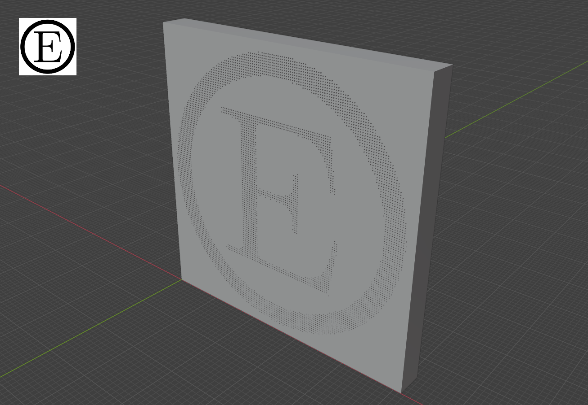

# EtchSTL

A program for turning images into 3D plates with an etched appearance. Intended for use in 3D printing applications, plates produced by EtchSTL can be incorporated into CAD models using CSG or printed directly as 3D models.

The development of EtchSTL stems from a need to incorporate text and other two-dimensional features into vertically-oriented surfaces of 3D printed designs. The most common approach to this (regardless of orientation) is to use embossing or debossing, but this tends to look better when printed horizontally than when printed vertically. In contrast, the method of applying text or graphics employed by EtchSTL is designed specifically for vertical printing.

Meshes produced by EtchSTL are composed of alternating structural and image layers. The image layers contain the "pixels" that make up the etched image while the structural layers provide a flat surface on top of which pixels higher up the Z axis can be printed directly. Experiments show this allows certain shapes to be printed more cleanly than with regular embossing or debossing, albeit at the cost of resolution.

Best results can be obtained by choosing a pixel size and pitch (or distance between pixels) that is a multiple of the layer height, and preferably larger (e.g. double the layer height). The plates are best printed vertically, as the number of small features in the resulting meshes can require complex paths when printed horizontally that can overwhelm some 3D slicers.



# Usage

```
etchstl.py [options] IMAGE

 -o FILENAME        output filename (default is stl.out)
 -t THICKNESS       plate thickness
 -p SIZE            pixel size
 -P PITCH           distance between pixels
 -d DEPTH           pixel depth
 -s SCALE           image scale (percent)
 -f SIZE            size of frame around image, in pixels
 -h                 show help
```